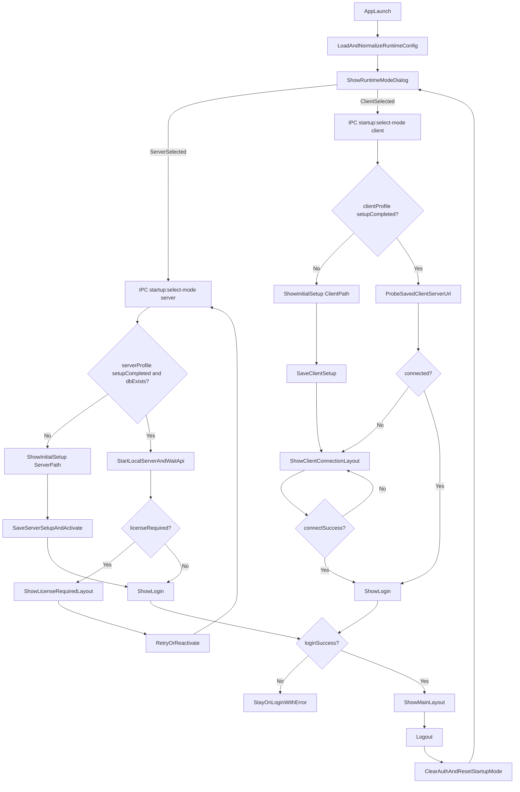
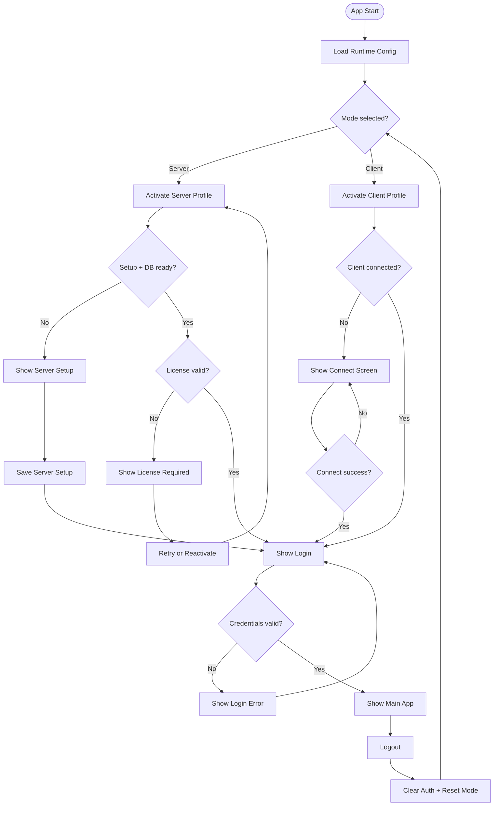

# App Startup Workflow

This document describes the current startup behavior implemented in development.

## Flow Diagram



## Classic Decision Flowchart (Mermaid)



## Classic ASCII Flowchart

```text
+---------------------------+
|        APP START          |
+-------------+-------------+
              |
              v
+---------------------------+
| Load/Normalize Config     |
+-------------+-------------+
              |
              v
+---------------------------+
| Choose Runtime Mode       |
| [ Server ] [ Client ]     |
+------+--------------------+
       | 
   +---+---+
   |       |
   v       v
+------------------------+      +------------------------+
|   SERVER MODE SELECT   |      |   CLIENT MODE SELECT   |
+-----------+------------+      +-----------+------------+
            |                               |
            v                               v
+---------------------------+    +---------------------------+
| Server profile complete?  |    | Client profile complete?  |
+-----------+---------------+    +-----------+---------------+
            | Yes                           | Yes
            |                               |
            v                               v
+---------------------------+    +---------------------------+
| Start local API + health  |    | Probe saved client URL    |
+-----------+---------------+    +-----------+---------------+
            |                               |
            v                               v
+---------------------------+    +---------------------------+
| License valid?            |    | Connected?                |
+-----+---------------------+    +-----+---------------------+
      | Yes                       | Yes
      |                           |
      v                           v
+---------------------------+    +---------------------------+
|         LOGIN             |<---|         LOGIN             |
+-----------+---------------+    +-----------+---------------+
            |                               |
            v                               v
+---------------------------+    +---------------------------+
|       MAIN APP UI         |    |       MAIN APP UI         |
+-----------+---------------+    +-----------+---------------+
            |                               |
            +---------------+---------------+
                            |
                            v
                 +-----------------------+
                 |        LOGOUT         |
                 +-----------+-----------+
                             |
                             v
                 +-----------------------+
                 | Reset auth + mode     |
                 +-----------+-----------+
                             |
                             v
                 +-----------------------+
                 | Choose Runtime Mode   |
                 +-----------------------+

Server "No" branches:
  - Server profile incomplete -> Initial Setup (Server path) -> Save -> Login
  - License invalid           -> License Required screen -> Retry/Reactivate

Client "No" branches:
  - Client profile incomplete -> Initial Setup (Client path) -> Connect screen
  - Not connected             -> Connect/Test URL screen -> on success -> Login
```

## High-level flow

1. Renderer loads and requests setup/runtime config.
2. User is shown **Choose Runtime Mode** (`Server` or `Client`) at startup.
3. The selected mode is activated by main-process IPC (`startup:select-mode`).
4. The UI gates access based on selected mode and config readiness:
   - setup required
   - license required (server only)
   - connection required (client only)
   - login

Logout always returns to mode selection.

## Runtime mode selection

- `startup-mode` is session state in `NavigationVM`.
- It is not persisted as a permanent lock.
- On selection:
  - `chooseStartupMode(mode)` calls `startup:select-mode`.
  - Main process activates the selected profile and returns effective config.

## Server mode branch

When user selects `Server`:

1. Main process activates server profile config (`profiles.server`).
2. If server setup is complete and DB path exists, server process starts.
3. API readiness is checked.
4. License status is resolved:
   - valid => continue
   - invalid => `licenseRequired` gate
5. UI flow:
   - setup incomplete => server setup wizard
   - license required => license action screen
   - otherwise => login

## Client mode branch

When user selects `Client`:

1. Main process activates client profile config (`profiles.client`).
2. Local server process is stopped.
3. Saved client URL is probed for connectivity.
4. UI flow:
   - setup incomplete => client setup
   - not connected => client connection screen
   - connected => login

Client can always change URL from login (`Change Server URL`).

## Config model

Runtime config stores mode-specific profiles:

- `profiles.server`
  - `setupCompleted`
  - `server` (`dbDirectory`, `dbFile`, `port`)
- `profiles.client`
  - `setupCompleted`
  - `client` (`serverUrl`)

Top-level `mode` and `setupCompleted` reflect the currently activated mode for this session.

Machine fingerprint remains separate in `machine-fingerprint.json`.

## Dev DB path behavior

In development (`VITE_DEV_SERVER_URL` present), default server DB directory resolves to:

- `api/data`

This keeps Electron server mode aligned with manual API runs (`cd api && npm run dev`) unless a different DB is explicitly configured.

## Refactoring notes applied

- Consolidated setup config normalization and client probe logic in `NavigationVM`:
  - `normalizeSetupConfig()`
  - `enrichClientConnectionState()`
- Mode activation is centralized through `startup:select-mode` instead of UI-only state mutations.


